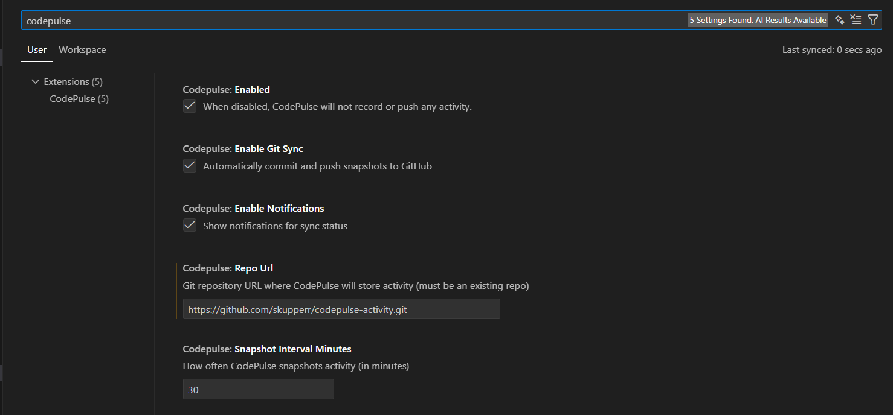

# CodePulse

CodePulse quietly tracks your coding activity and snapshots it to a Git repository you own.

No accounts. No dashboards. No external servers.  
Your data lives in Git — where it belongs.

---

## Why CodePulse

GitHub contribution graphs don’t tell the full story.

CodePulse captures real coding effort, even when you’re:

- Working locally
- Learning new technology
- Offline
- Experimenting without committing to a project repository

---

## What It Does

- Tracks files edited, languages used, and lines changed
- Creates timestamped JSON activity snapshots
- Pushes snapshots to a Git repository **you control**
- Works offline and retries automatically when connectivity returns
- Manual **Force Snapshot** button in the status bar

---

## Gap Analysis vs Other Extensions

| Feature | Other VS Code Activity Extensions | CodePulse |
|---------|---------------------------------|-----------|
| Open-source / external repo support | ❌ Requires push access to each project repo; impossible for most open-source contributions | ✅ Snapshots go to your own activity repo; can track any project without affecting project repos |
| Authentication | ⚠️ Requires GitHub personal access token | ✅ Uses existing VS Code Git authentication; no extra token needed |
| Activity commit destination | ⚠️ Commits directly to project repo, polluting history | ✅ Commits only to your dedicated activity repo |
| Repository requirement | ❌ Must have a repo for each project/folder you work on | ✅ Only your dedicated activity repo is needed; you can track learning, demos, or experiments without a project/folder repo |
| Offline support | ❌ Often fails if offline | ✅ Stores snapshots locally and retries automatically when connectivity returns |
| Setup complexity | ⚠️ Must configure multiple repos or tokens | ✅ Only one repo URL required (your activity repo) |

> CodePulse lets you track coding activity across all your projects, without worrying about polluting project histories or being blocked on permissions.

---

## Prerequisites

Before using CodePulse, ensure the following:

- **Git is installed** and available in your system PATH
- **You are signed into GitHub in VS Code**
  - Open the Accounts menu (bottom-left) and sign in
- **The configured repository belongs to you** or you have push access
- **Repository URL uses HTTPS** (recommended)

> CodePulse relies on your existing Git authentication.  
> If you are not authenticated or lack permission, pushes will fail.

---

## Setup

1. Install CodePulse
2. Create a Git repository (public or private) — this will be your **activity repo**
3. Open **Settings → CodePulse**
4. Set the **Repository URL (HTTPS)**
5. Ensure GitHub authentication is active in VS Code
6. Start coding

Snapshots will be created automatically based on the configured interval.

---

## Manual Snapshot

Use the **CodePulse** button in the status bar or run:

- **CodePulse: Force Snapshot**

This immediately creates a snapshot and attempts to sync it.

---

## Offline & Error Handling

- If you are offline:
  - Activity is stored locally
  - CodePulse retries automatically
  - You are notified when syncing resumes

- If the repository does not exist or you lack permission:
  - You will see an explicit error message
  - Automatic retries are disabled until fixed

---

## Configuration / Settings

| Setting | Type | Default | Description |
|---------|------|---------|-------------|
| `enabled` | Boolean | `true` | Enable or disable CodePulse tracking. |
| `snapshotIntervalMinutes` | Number | `30` | Interval (in minutes) between automatic snapshots. Minimum is 5 minutes. |
| `enableGitSync` | Boolean | `true` | Enable pushing snapshots to a Git repository. |
| `repoUrl` | String | `""` | HTTPS URL of the Git repository where snapshots will be stored. Must be a repo you can push to. |
| `enableNotifications` | Boolean | `true` | Show VS Code notifications for successful syncs or errors. |

> ⚠️ **Important:** Changing the repository URL will remove the previous local repository and clone the new one.

---

## Settings UI

You can configure CodePulse directly from the **VS Code Settings** panel.

### Example: General Settings

- Enable/disable tracking  
- Set snapshot interval  
- Toggle Git sync  

---

## Privacy

CodePulse does **not** collect or transmit data to any external service.

All activity data:

- Is generated locally
- Is stored locally
- Is pushed **only** to the Git repository you explicitly configure

See [PRIVACY.md](PRIVACY.md) for full details.

---

## License

MIT. See [LICENSE.txt](LICENSE.txt) for full license details.

---

## Contact

For any questions or suggestions, please open an issue on the GitHub repository or reach out to me directly.  

[**GitHub Repository**](https://github.com/skupperr/code-pulse.git)
